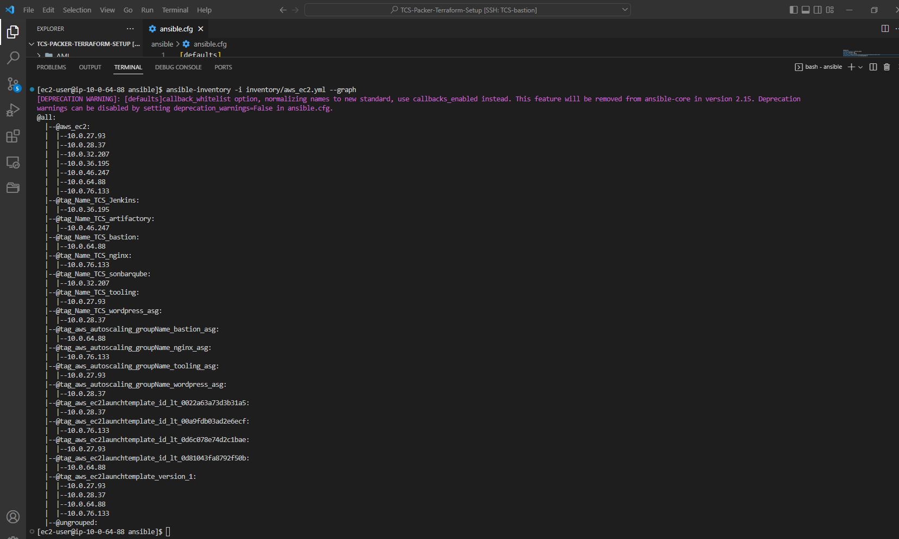
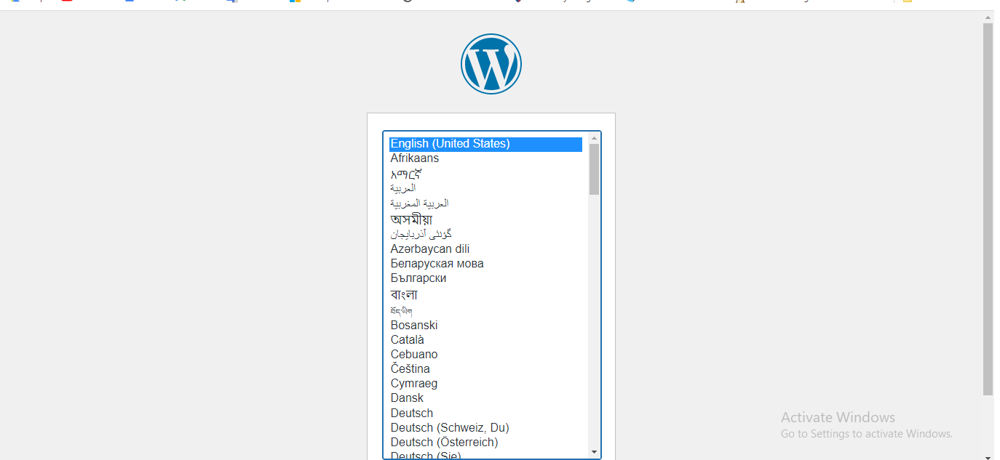

# Automate Infrastructure With IaC using Terraform – Terraform Cloud


This project introduces us to the concept of terraform cloud which is explained below:

**Terraform Cloud** is a managed service that provides you with Terraform CLI to provision infrastructure, either on demand or in response to various events.

By default, Terraform CLI performs operation on the server whenever it is invoked, it is perfectly fine if you have a dedicated role who can launch it, but if you have a team who works with Terraform – you need a consistent remote environment with remote workflow and shared state to run Terraform commands.

This Project is a continuation of project 18, however, the following will be added:

The files that would be Addedd is;

**PACKER:** for building AMI images

Packer is an open source tool for creating identical machine images for multiple platforms from a single source configuration. Packer is lightweight, runs on every major operating system, and is highly performant, creating machine images for multiple platforms in parallel.

**ANSILE:** for Ansible scripts to configure the infrastucture

**Installing Packer:** 

Packer was installed with chocolatey package manager with the following command:
```markdown
choco install packer

```
**BOTO**

Boto is a software development kit (SDK) designed to improve the use of the Python programming language in Amazon Web Services. The Boto project started as a customer-contributed library to help developers build Python-based applications in the cloud, converting application programming interface (API) responses from AWS into Python classes.

Boto has become the official AWS SDK for Python. Boto versions include Boto, Boto3 and Botocore. Boto3 is the latest version of the SDK, providing support for Python versions 2.6.5, 2.7 and 3.3. Boto3 includes several service-specific features to ease development. Boto supports all current AWS cloud services, including Elastic Compute Cloud, DynamoDB, AWS Config, CloudWatch and Simple Storage Service.

Boto3 replaced Boto version 2, which lacks compatibility with the latest versions of Python, but still appeals to software developers using older versions of the programming language. Botocore provides more rudimentary access to AWS tools, simply making low-level client requests and getting results from APIs.

Boto derives its name from the Portuguese name given to types of dolphins native to the Amazon River.


We refactored our terraform codes into modules and as a result the introduction of modules into our codebase helped save time and reduce costly errors by re-using configuration written either by yourself, other members of your team, or other Terraform practitioners who have published modules for you to use.

We require AMIs that are preconfigured with necessary packages for our applications to run on specific servers.


## Action Plan for project 19

- Build images using packer
- confirm the AMIs in the console
- update terrafrom script with new ami IDs generated from packer build
- create terraform cloud account and backend
- run terraform script
- update ansible script with values from teraform output
     - RDS endpoints for wordpress and tooling
     - Database name, password and username for wordpress and tooling
     - Access point ID for wordpress and tooling
     - Internal load balancee DNS for nginx reverse proxy

- run ansible script
- check the website

In this project, we will be introducing two new concepts 
- **Packer**
- **Terraform Cloud**
#
## What is Packer? 
#
Packer is an open source tool for creating identical machine images for multiple platforms from a single source configuration. Packer is lightweight, runs on every major operating system, and is highly performant, creating machine images for multiple platforms in parallel.
#

## Step 1. Creating Bastion, Nginx, Tooling and Wordpress AMIs 
#
We write packer code which helps us create AMIs for each of the following mentioned servers. A sample of the code can be found here: [packer code setup](https://github.com/Tonybesto/TCS-Packer-Terraform-Setup/tree/main/AMI)

For each of the following `.pkr.hcl` files, we run the following commands
```
- packer fmt <name>.pkr.hcl
- packer validate <name>.pkr.hcl
- packer build <name>.pkr.hcl
```


#

## Step 2. Setting Up Infrastructures using Terraform Cloud
#
In this project, we changed the backend from S3 to a remote backend using Terraform Cloud. TF Cloud manages all state in our applications and carries out tf plan , tf validate and applies our infrastructures as required.

To do this, we setup an organization on terraform cloud and a workspace and link our workspace to our repository. On every commit, a webhook is triggered on terraform cloud and plans or applies our terrraform code based on need.


## Step 3. Ansible Dynamic Inventory
#
A dynamic inventory is a script written in Python, PHP, or any other programming language. It comes in handy in cloud environments such as AWS where IP addresses change once a virtual server is stopped and started again.

We make use of dynamic inventory to get Ip address of our servers created based on their tag names and hence we are able to run the required role on each server.



#

##  Step 4. Checking Successful 
#


#

## Step 5. Destroying Resources
#


### Draw back in the scripts
- Direct hardcoding of values
- Inputting credentials directly in the script

- Useful links for windows users

https://docs.microsoft.com/en-us/windows-server/administration/openssh/openssh_keymanagement
https://docs.microsoft.com/en-us/windows-server/administration/openssh/openssh_install_firstuse
https://medium.com/risan/upgrade-your-ssh-key-to-ed25519-c6e8d60d3c54


**Challenges and Solution**

1. Ansible did not see aws infrastructure: aws configure

3. Ansible did not update db info: I had to vi into wp-config.php to rectify

4. I realised that when autoscale scale in to zero, all ansible installed data are lost.

5. The servers could not download from the internet: I had to create route table using Natgateway as route

6. Target groups were not automatically registered: I had to manually register them before my instances could be healthy

7. Pip installation was not in the user data for creating AMIs, hence, boto and boto3 were not automatical installed: I had to install manualy, I have corrected the script though.

8. Although, the wordpress site did not open though, but tooling opens as expected